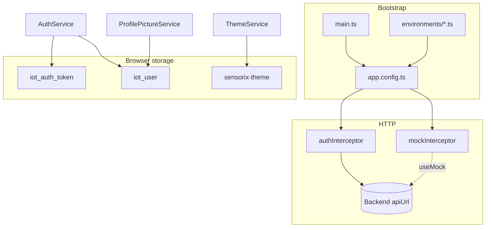

# IoT Frontend — Configuration, Structure & Tests

This document describes **where configuration lives**, the **component architecture**, and an **overview of unit tests** for the `iot-frontend` Angular application (v21, standalone components, Vitest via `@angular/build:unit-test`).

---

## 1. Build & toolchain

| What | Where | Notes |
|------|--------|--------|
| npm scripts | `package.json` | `start` → dev server; `build` → production; `test` → `ng test`; `mock-api` → json-server on port 3001 (legacy/auxiliary) |
| Angular CLI project | `angular.json` | App name `iot-frontend`, prefix `app`, SCSS default for components |
| TypeScript (strict) | `tsconfig.json` | Strict templates, ES2022, project references to `tsconfig.app.json` / `tsconfig.spec.json` |
| App compilation | `tsconfig.app.json` | Application sources under `src/` |
| Test compilation | `tsconfig.spec.json` | Spec files + Vitest test bed |
| Global styles & theme tokens | `src/styles.scss` | Angular Material theme, CSS variables (`--background`, `--sensorix-teal`, etc.), light/dark via `body[data-theme]` |
| Static assets | `public/` | Copied into build output (`angular.json` → `assets`) |
| Entry point | `src/main.ts` | `bootstrapApplication(App, appConfig)` |
| Root component | `src/app/app.ts` | Shell with `<router-outlet>` only |

### Build configurations (`angular.json`)

| Configuration | When used | Key settings |
|---------------|-----------|--------------|
| **development** | `npm start` (`ng serve --configuration development`) | Source maps, no optimization; **replaces** `environment.ts` with `environment.development.ts` |
| **production** | `npm run build` | Output hashing, bundle budgets (initial ≤ 1 MB, component styles ≤ 8 kB) |

---

## 2. Runtime / environment configuration

| Setting | File(s) | Purpose |
|---------|---------|---------|
| `production` | `src/environments/environment.ts` | Production build flag |
| `apiUrl` | Both environment files | Base URL for all HTTP API calls (default `http://localhost:8080/api`) |
| `useMock` | Both environment files | When `true`, registers `mockInterceptor` in addition to `authInterceptor` |

**File replacement:** `ng serve` / development build swaps `environment.ts` → `environment.development.ts` via `angular.json` `fileReplacements`.

**Wiring:** `src/app/app.config.ts` reads `environment.useMock` and chooses HTTP interceptors:

```typescript
environment.useMock === true
  ? provideHttpClient(withInterceptors([authInterceptor, mockInterceptor]))
  : provideHttpClient(withInterceptors([authInterceptor]));
```

---

## 3. Application providers (`app.config.ts`)

| Provider | Location | Role |
|----------|----------|------|
| `provideBrowserGlobalErrorListeners()` | `app.config.ts` | Global browser error handling |
| `provideRouter(routes)` | `app.config.ts` | Client-side routing from `app.routes.ts` |
| `provideHttpClient(...)` | `app.config.ts` | HTTP client + interceptors (see below) |

---

## 4. Routing & guards

**Defined in:** `src/app/app.routes.ts` (lazy-loaded standalone components).

| Route | Guard | Component |
|-------|--------|-------------|
| `''` | — | Redirect → `/signup` |
| `/signup` | `publicGuard` | `SignupComponent` |
| `/login` | `publicGuard` | `LoginComponent` |
| `/home` | `authGuard` | `HomeComponent` |
| `/profile` | `authGuard` | `ProfileComponent` |
| `/settings` | `authGuard` + `canDeactivate` | `Settings` |
| `**` | — | `NotFoundComponent` |

| Guard | File | Behavior |
|-------|------|----------|
| `authGuard` | `core/guards/auth.guard.ts` | Requires `AuthService.getToken()`; else redirect to `/login` |
| `publicGuard` | `core/guards/public.guard.ts` | Blocks login/signup when already authenticated → `/home` |

---

## 5. HTTP layer

### Interceptors

| Interceptor | File | When active | Responsibility |
|-------------|------|-------------|----------------|
| `authInterceptor` | `core/interceptors/auth.interceptor.ts` | Always | Attaches `Authorization: Bearer <token>` to `environment.apiUrl` requests; skips `POST /auth/login` and `POST /auth/register`; on token-auth 401 → `clearSession()` + navigate to `/login` |
| `mockInterceptor` | `core/interceptors/mock.interceptor.ts` | `environment.useMock === true` | In-memory mock for auth, profile, picture upload/download (dev without backend) |

### Core services (API & state)

| Service | File | Backend / storage |
|---------|------|-------------------|
| `AuthService` | `core/services/auth.service.ts` | Login, register, `getMe`, password, profile picture PATCH; **localStorage** `iot_auth_token`, `iot_user`; `currentUser` signal |
| `ProfilePictureService` | `core/services/profile-picture.service.ts` | Publishes the saved public profile image URL from the current user signal |
| `SettingsService` | `core/services/settings.service.ts` | `GET/PUT /intervals`, threshold CRUD; in-memory `BehaviorSubject` cache |
| `AlertsService` | `core/services/alerts.service.ts` | Alert list + delete; `alertDeleted$` stream |
| `ThemeService` | `core/services/theme.service.ts` | **localStorage** `sensorix-theme`; toggles `body[data-theme]` |

### Validation & auth rules

| What | File |
|------|------|
| Length limits, image size (1 MB), allowed MIME types | `core/validation/auth-validation.constants.ts` |
| Form validators (`profileImageError`, password rules) | `core/validation/auth-validators.ts` |
| API error → user message (400/401/409/429/5xx, blob errors) | `core/utils/auth-error.ts` |
| DTO → `User` mapping | `core/utils/auth-user.mapper.ts` |
| Public profile image URL helper | `core/utils/profile-picture.ts` |

### Models

| File | Contents |
|------|----------|
| `core/models/user.model.ts` | `User`, `UserProfileResponse` |
| `core/models/auth.models.ts` | Login/register payloads, `ApiErrorResponse`, etc. |
| `features/home/models/sensor-reading.models.ts` | Sensor reading types for dashboard cards |
| `features/settings/settings.types.ts` | Thresholds, tabs, default sensor configuration |

---

## 6. localStorage keys (summary)

| Key | Set by | Purpose |
|-----|--------|---------|
| `iot_auth_token` | `AuthService.saveToken` | JWT / session token |
| `iot_user` | `AuthService.saveUser` | Serialized `User` (includes public `profilePicture` URL, not image bytes) |
| `sensorix-theme` | `ThemeService` | `light` or `dark` |

Cleared on logout: token and user (`AuthService.clearSession`).

---

## 7. Component structure

High-level layout: **feature routes** compose **shared** UI (topbar, logo, dialogs) and **feature-specific** children.

```
src/app/
├── app.ts                    # Root: router-outlet
├── app.config.ts             # Providers
├── app.routes.ts             # Routes + guards
│
├── core/                     # App-wide, non-UI
│   ├── guards/
│   ├── interceptors/
│   ├── models/
│   ├── services/
│   ├── utils/
│   └── validation/
│
├── shared/components/        # Reused across features
│   ├── topbar/               # Logo, notifications, theme, profile avatar
│   ├── sensorix-logo/
│   ├── notification-panel/
│   ├── confirm-dialog/
│   └── alert-toast/
│
└── features/
    ├── auth/
    │   ├── login/            # Login form → token + getMe → /home
    │   └── signup/           # Register → login → optional picture upload
    ├── home/                 # Dashboard (authenticated)
    │   ├── home.component    # Topbar + hero + sensor cards
    │   ├── services/
    │   │   └── sensor-readings.service.ts
    │   └── components/
    │       ├── traffic-sensor-card/      (+ traffic-alerts)
    │       ├── air-quality-sensor-card/  (+ air-quality-alerts)
    │       └── street-light-card/        (+ street-light-alerts)
    ├── profile/              # Avatar, password change, logout
    ├── settings/             # Thresholds + sensor interval configuration
    │   └── components/
    │       ├── settings-thresholds-panel.component.ts
    │       └── settings-configuration-panel.component.ts
    └── not-found/
```

### Feature composition

| Page | Key child components | Shared |
|------|----------------------|--------|
| **Home** | `TrafficSensorCardComponent`, `AirQualitySensorCardComponent`, `StreetLightCardComponent` (each embeds its alerts sub-component) | `TopbarComponent`, `NotificationPanelComponent` |
| **Profile** | Inline avatar upload, password modal | — |
| **Settings** | `SettingsThresholdsPanelComponent`, `SettingsConfigurationPanelComponent` | `TopbarComponent`, `ConfirmDialogComponent` |
| **Login / Signup** | Reactive forms, `SensorixLogoComponent` | — |

### Change detection

Most feature and shared components use **`ChangeDetectionStrategy.OnPush`** and signals/`computed` where applicable.

---

## 8. Data flow highlights

### Authentication

1. Login/signup → `AuthService` stores token + user.
2. Login also calls `getMe()` so `profilePicture` path is available immediately.
3. `authGuard` / `publicGuard` gate routes.

### Profile picture

1. `User.profilePicture` holds a **server filesystem path** (not a display URL).
2. `ProfilePictureService` watches `currentUser`; on path change:
   - Try **localStorage** cache (`userId` + path).
   - Else **GET** `/api/user/profile/picture` once, cache as data URL.
3. Topbar and profile page bind to `ProfilePictureService.pictureUrl` / `loadError` (429 message).

### Home dashboard

1. `HomeComponent` refreshes user via `getMe()` on load.
2. Sensor cards use `SensorReadingsService` / `AlertsService` for readings and alerts.
3. `TopbarComponent` → `NotificationPanelComponent` can deep-link to sensors via query params / `openSensorAlerts` custom event.

### Settings

1. `Settings` loads intervals (`SettingsService.loadSensorConfig`) and thresholds (`getSettings`).
2. Dirty state + `canDeactivate` confirm dialog before leaving.
3. Save persists intervals and threshold CRUD to API.

---

## 9. Unit tests overview

**Runner:** Vitest 4.x via `ng test` (`@angular/build:unit-test`).  
**Location convention:** `*.spec.ts` next to the file under test.  
**Total:** 23 spec files, **~106** test cases (count may change as tests are added).

### How to run

```bash
cd iot-frontend
npm test              # watch mode
npx ng test --no-watch   # single run
```

Filter examples:

```bash
npx ng test --no-watch --include="**/profile*.spec.ts"
```

### Tests by area

#### App shell & routing

| File | Focus |
|------|--------|
| `app.spec.ts` | Root component creation and title |
| `core/guards/auth.guard.spec.ts` | Token present → allow; missing → `/login` |

#### HTTP & auth core

| File | Focus |
|------|--------|
| `core/interceptors/auth.interceptor.spec.ts` | Bearer header, public endpoints exempt, 401 token logout vs domain 401 |
| `core/services/auth.service.spec.ts` | Login/register/picture PATCH HTTP; localStorage; logout; `clearSession` clears session state |
| `core/utils/auth-error.spec.ts` | `mapAuthError` for 400/401/429 (JSON + blob bodies), network, unknown |
| `core/utils/auth-user.mapper.spec.ts` | Auth vs profile response → `User` |
| `core/utils/profile-picture.spec.ts` | `hasProfilePicture` public URL validation |
| `core/services/profile-picture.service.spec.ts` | Public URL propagation, legacy value ignore, invalidation |

#### Services (domain)

| File | Focus |
|------|--------|
| `core/services/settings.service.spec.ts` | Load/save sensor intervals |
| `core/services/alerts.service.spec.ts` | Get alerts, delete + `alertDeleted$` |

#### Auth features

| File | Focus |
|------|--------|
| `features/auth/login/login.component.spec.ts` | Validation, email normalize, login + `getMe`, errors, password visibility |
| `features/auth/signup/signup.component.spec.ts` | Validation, password policy, register chain + picture upload, image rules |

#### Profile & home

| File | Focus |
|------|--------|
| `features/profile/profile.component.spec.ts` | Profile load from `getMe`, back navigation, logout success/failure |
| `features/home/home.component.spec.ts` | `getMe` refresh, error notices, `openSensorAlerts` event |

#### Home sensor UI

| File | Focus |
|------|--------|
| `traffic-sensor-card.component.spec.ts` | Readings, history index, `openSensorAlerts` |
| `air-quality-sensor-card.component.spec.ts` | Pollution schema, scaling, alerts event |
| `street-light-card.component.spec.ts` | Readings, totals, alerts event |
| `traffic-alerts.component.spec.ts` | Alert list, filters, colors, delete |
| `air-quality-alerts.component.spec.ts` | Same pattern for air quality |
| `street-light-alerts.component.spec.ts` | Same pattern for street lights |

#### Settings & shared UI

| File | Focus |
|------|--------|
| `features/settings/settings.spec.ts` | Tabs, dirty guard, threshold add/toggle/remove, navigation |
| `shared/components/notification-panel/notification-panel.component.spec.ts` | Badge, panel toggle, outside click, delete stream |

### Related docs

| Doc | Purpose |
|-----|---------|
| `docs/qa-local.md` | Manual QA steps for auth/profile in dev |
| `docs/unit-tests-for-dashboard-and-settings.md` | Additional notes on dashboard/settings tests |

---

## 10. Quick reference diagram



---

### Production build preview & CORS

When you serve the built app locally (e.g. `npx serve dist/iot-frontend/browser -l 4300`), the browser origin is **`http://localhost:4300`**, not `4200`. The backend must allow that origin in `iot-backend/.../CorsConfig.java` (patterns `http://localhost:*` cover all local ports). **Restart the backend** after CORS changes.

If login/signup show a generic server error and the network tab says **CORS blocked**, the API call never reached the server — fix origins, or preview on an allowed port (e.g. `4200` if that is already listed).

---

*Last updated to reflect public profile picture URLs and centralized `ProfilePictureService`.*
